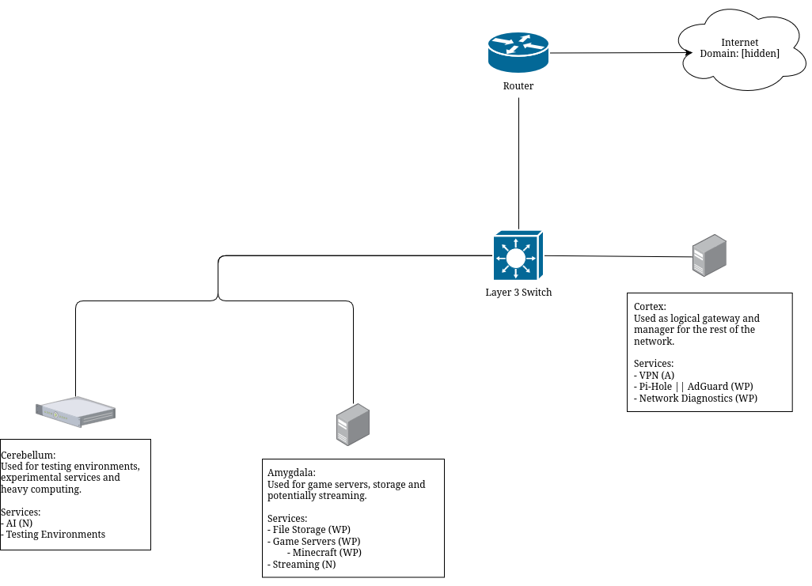

# Luci Paz Homelab Project

## Project Description

The aim of this project is to learn how to manage a network, self host services, 
expand my knowledge beyond the classroom and document the journey. 

This repo will contain:
- descriptions of the services I am running 
- documentation on the learning process
- links to helpful websites used
- code for custom scripts or config files

My hope is that this project will serve as a good resource for others wanting to 
create their own homelabs, showing off what is possible through lots of research,
stuborness and the determination to have more control over the services we use.

The rest of this README will provide some high level information about the lab.
More in-depth documentation will be created and stored in a more formal document
later. This future document will become the main place to find updated information
about the lab such as helpful links, thought processes and service notes.

---

## Basic Network Outline

The lab is in its early stages at the moment but below is a basic diagram of computer 
connections and some of the services hosted on each device.

> note: My implementation includes some security features that a lot of people
> in forums seem to say are un-needed because "we are most likely not important
> enough to need these levels of security so don't worry about it", while this
> may be true, I am doing them anyways because I think its good to know and its
> fun, even if it takes longer to figure out and might be overly complex.

My current design has `cortex` as the main entry point into the lab network. To
connect to `cortex`, a VPN config is required. This is to help limit access to
verified users and make the creation of custom nftable rules a little easier.
This access lets me control what accounts people can log into, where they are
allowed to try to connect to, what services they can access and more. `Cortex`
will also host an ad blocking service in the future such as PiHole or AdGuard,
these require more research though and have not yet been implemented.

Once connected to the VPN server on `cortex`, depending on a user's permissions
they can attempt to access the services on the other two devices (`amygdala` and
`cerebellum`).

`amygdalla` will be the server that most trusted users will have access to. It will 
host a storage server, potentially some game servers and maybe a streaming service 
like Jellyfin. 

`cerebellum` will not be accessible by most users of the lab. This server is 
a little more powerful than the other two and will be used for testing new services, 
programming and potentially hosting a local AI, however this will require adding a 
GPU to this thing which has been a task to research and with current market trends, 
won't be done for awhile.

---

## Future TODOs

I have a lot planned for the future of this project and below, in no particular 
order, is some of what I would like to accomplish.

1. Create vlans to further separate devices and add some additional layers of
security. I would like to separate `cortex` from the other two as well as create
a vlan for future IOT devices.
    - IOT devices are notoriously insecure so some extra separation would be nice

2. Create more robust and better documented scripts for creating new users with
valid VPN configs, correct permissions, access to only required devices and
correct routing rules to facilitate this.

3. Finish working on the file storage server on `amygdala`
> note: File storage might move to a more dedicated server in the future with
> a larger storage capacity, but right now it will be here.
    - Ensure users can only access their files

4. Setup ad blocking service for the network

5. Get a proper domain name that I can use for sending connections to the correct
services and making resolution easier.

6. Setup an email server so I can have more control over who can see my emails.
    - This will have to happen after the domain name is acquired since emailing
      with just IP addresses is not easily done anymore from what I can tell.

